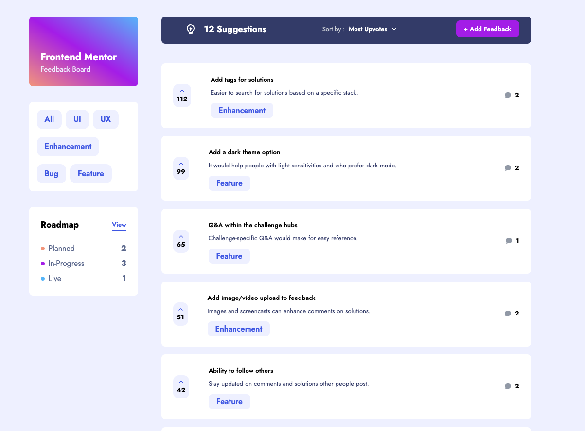
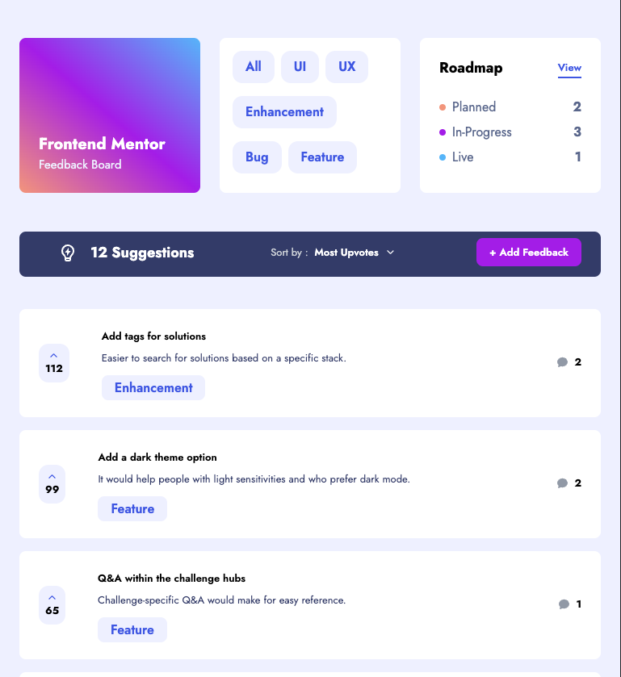
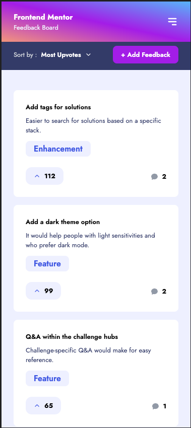

## Frontend Mentor Challenges

### [Frontend Mentor](https://www.frontendmentor.io/)

### Purpose

- The purpose of this repo is to work on frontend challenges and complete them in html, css and javascript or whatever framework/frontend tool I'd like to learn more about.

### Product Feedback App [Demo In-Progress](https://unrivaled-sprinkles-d441b7.netlify.app/)

- Technologies
  - **Typescript**, **React JS**, **Tailwind CSS**, **Parcel**
- Currently using static data, but will implement a small node js app in near future

#### Desktop

#### Tablet

#### Mobile

